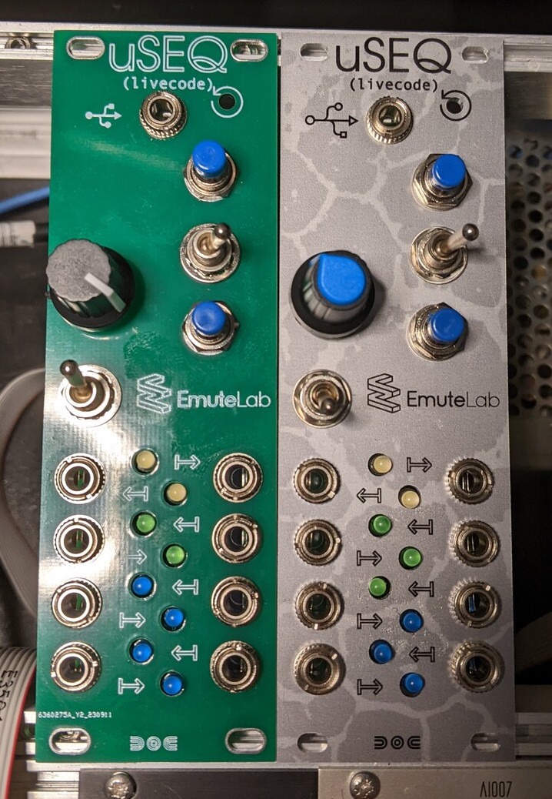
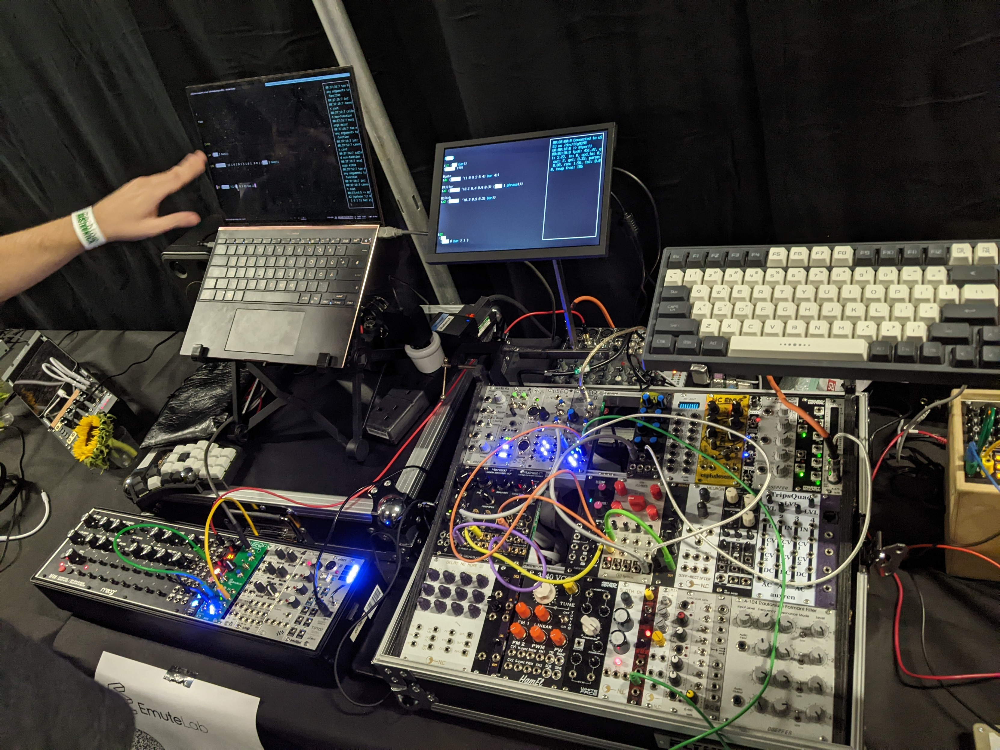

# uSEQ

uSEQ is a livecodeable eurorack module.

There's a paper on it here: 

Kyriakoudis, Dimitris, & Kiefer, Chris. (2023, April 19). uSEQ: A LISPy Modular Sequencer for Eurorack with a Livecodable Microcontroller. 7th International Conference on Live Coding (ICLC2023), Utrecht, The Netherlands. https://doi.org/10.5281/zenodo.7843874



uSEQ modules, two panel designs (PCB, Aluminium)



uSEQ modules set up within eurorack performance systems


## Features:

* Open source hardware and software
* Low-cost DIY project
* Live code using a simple LISP language library, from a laptop or mobile device, using serial-over-USB
* Stream waveforms back over USB serial to a computer, and route it to MIDI or OSC, linking the modular with software and external hardware
* Livecoding engine with flexible timing and varied options for creating gate and CV patterns (from basic waveforms to euclidean sequencing) and structuring arrangements


More info from [https://www.emutelabinstruments.co.uk/useq/](https://www.emutelabinstruments.co.uk/useq/)

## [Developer notes](docs/dev.md)
## Code Organization

The codebase is organized into the following modules:

### Core Components
- **uSEQ.h/cpp**: Main class definition and implementation
- **uSEQ_Core.cpp**: Core functionality (run, tick methods)
- **uSEQ_Signals.h/cpp**: Signal processing and filter implementations
- **uSEQ_IO.h/cpp**: Input/output handling
- **uSEQ_Init.h/cpp**: Initialization and setup
- **uSEQ_Timing.h/cpp**: Clock and timing management
- **uSEQ_Scheduler.h/cpp**: Event scheduling
- **uSEQ_Storage.h/cpp**: Flash memory operations
- **uSEQ_LispFunctions.h/cpp**: LISP interpreter integration
- **uSEQ_HardwareControl.h/cpp**: Hardware-specific functionality
- **uSEQ_Modules.h**: Module configuration and enabling

### LISP Interpreter 
- **lisp/**: The embedded LISP interpreter

### DSP
- **dsp/**: Digital signal processing components

### Utilities
- **utils/**: Utility functions and helper classes

## Modular Architecture

The codebase uses a modular architecture with preprocessor guards to enable/disable specific modules. This allows for easier maintenance and testing of individual components. The module system is controlled by `uSEQ_Modules.h`, which contains flags to enable/disable each module.

To migrate functionality from the monolithic uSEQ.cpp to the modular architecture:

1. Create module headers and stub implementations with proper preprocessor guards
2. Set USE_NEW_MODULES to 0 initially to avoid duplicate symbol errors
3. After migrating a module's functionality, enable it by setting its flag to 1
4. Build, test, and verify functionality
5. Repeat for each module until all have been migrated
6. Finally set USE_NEW_MODULES to 1 and remove original code from uSEQ.cpp

## Building the Firmware

The firmware is in the [uSEQ](./uSEQ/) folder.

Build the firmware in Arduino IDE, using the [Earle Philhower Pico core](https://github.com/earlephilhower/arduino-pico).

| Setting  | Value |
| ------------- | ------------- |
| Board  | Generic RP2040  |
| Boot Stage 2  | W25Q080 QSPI /2  |
| Flash Size | 8MB (Sketch 1MB, FS: 7MB) |
| CPU Speed | 250MHz (Overclock) |
| Optimize | Optimize Even More (-O3) |

Overclock the Pico at 250Mhz and set the optimisation level to -O3.

You can also build using the arduino-cli:
```bash
arduino-cli compile --fqbn rp2040:rp2040:rpipico uSEQ/uSEQ.ino
```

We welcome pull requests.
