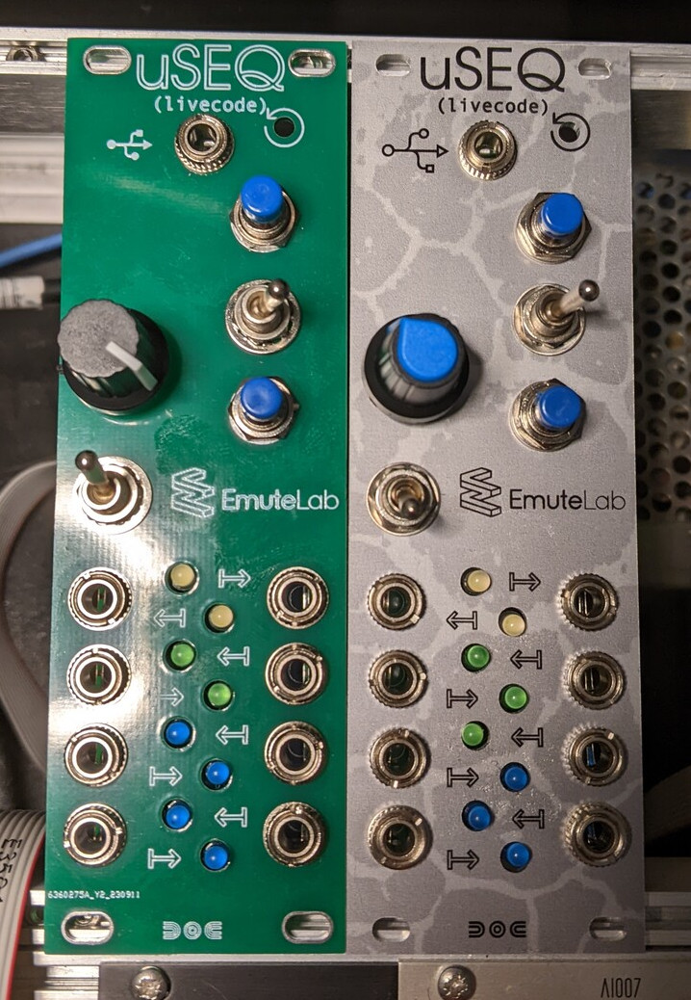
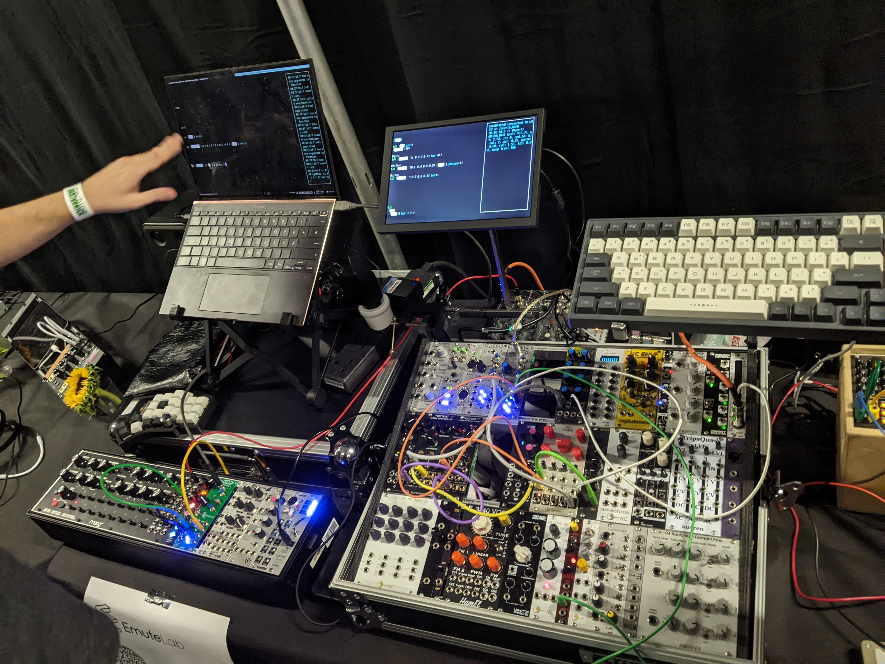

# uSEQ

uSEQ is a livecodeable eurorack module.

There's a paper on it here: 

Kyriakoudis, Dimitris, & Kiefer, Chris. (2023, April 19). uSEQ: A LISPy Modular Sequencer for Eurorack with a Livecodable Microcontroller. 7th International Conference on Live Coding (ICLC2023), Utrecht, The Netherlands. https://doi.org/10.5281/zenodo.7843874

uSEQ modules, two panel designs (PCB, Aluminium)

uSEQ modules set up within eurorack performance systems

## Features:

* Open source hardware and software
* Low-cost DIY project
* Live code using a simple LISP language library, from a laptop or mobile device, using serial-over-USB
* Stream waveforms back over USB serial to a computer, and route it to MIDI or OSC, linking the modular with software and external hardware
* Livecoding engine with flexible timing and varied options for creating gate and CV patterns (from basic waveforms to euclidean sequencing) and structuring arrangements

More info from [https://www.emutelabinstruments.co.uk/useq/](https://www.emutelabinstruments.co.uk/useq/)

## Canonical Specs

The firmware/language specs live in [docs/specs/MAIN.md](docs/specs/MAIN.md).
Protocol details live in [docs/specs/wire-protocol.md](docs/specs/wire-protocol.md).
Read [MAP.md](MAP.md) for the repository index and [ALIGNMENT.md](ALIGNMENT.md)
for the dated mission-level gaps.

## Verification

- `meson setup build && meson compile -C build && meson test -C build` runs
  the native suites.
- `python3 scripts/run_conformance.py --probe build/test/signal_engine_probe --target native`
  runs the shared language corpus against the native probe.
- `scripts/build_wasm.sh` builds and checks the generated interpreter;
  `python3 scripts/run_conformance.py --target wasm` runs the same corpus
  against it; `python3 scripts/wasm_manifest.py verify` verifies its compiler
  record.
- `pio run -e musicthing` establishes target compile, link, and static size;
  it is not a physical-execution result.

## Building the Firmware

The firmware is in the [uSEQ](./uSEQ/) folder.

Build the firmware in Arduino IDE, using the [Earle Philhower Pico core](https://github.com/earlephilhower/arduino-pico).

| Setting  | Value |
| ------------- | ------------- |
| Board  | Generic RP2040  |
| Boot Stage 2  | W25Q080 QSPI /2  |
| Flash Size | 8MB (Sketch 1MB, FS: 7MB) |
| CPU Speed | 250MHz (Overclock) |
| Optimize | Optimize Even More (-O3) |

Overclock the Pico at 250Mhz and set the optimisation level to -O3.

We welcome pull requests.
