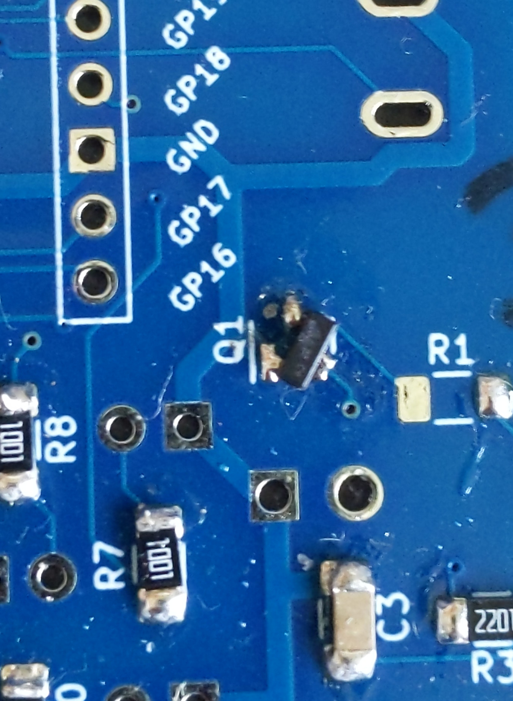
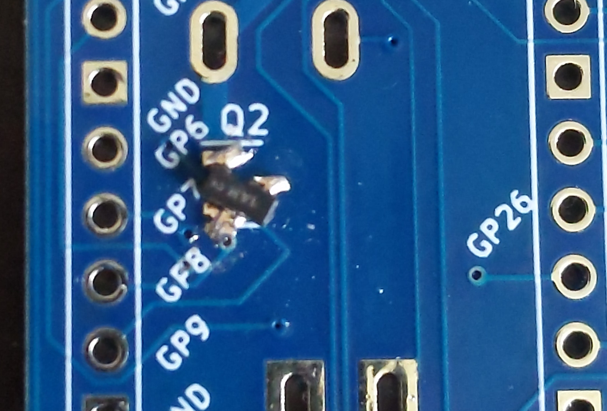

# uSEQ Hardware v0.1

The PCB has the text *(version USEQ 0.1)* on the front side.

## Front panel

Use the front panel from v0.2

## PCB

The PCB is nearly identical to v0.2, except for:

1. There is a workaround for placing the transistors (see below)
3. This PCB does not have the expansion port, but you can manually solder extra wires onto the Pico pins as needed.

### Transistor Placement

The PCB footprints for the two NPN transistors are incorrect, so the transistors need to be rotated on top of the original footprint.  This is slight awkward but dooable, see the images below

