# uSEQ hardware version 0.2

## Features

* Pi Pico microprocessor with Lisp-style livecoding engine
* Inputs
  * Two momentary switches
  * Two toggle switches
  * A rotary encoder + momentary switch
  * Two trigger/gate inputs (approx 0.2v threshold)
* Outputs
  * 6 outputs, configurable as either digital or CV (using PWM), 0-5V
* Serial port expansion for MIDI IO or connection to other uSEQ modules


## PCB configurations

### Digital and PWM Outputs

The 6 outputs can be configured either as digital or continuous (using PWM). The outputs are marked as PWM_OUT 1&2, and D Out 1-4 on the schematic.  Each output has a connection for a capacitor and resistor. For digital outputs use a 1K resistor and no capacitor, for PWM outputs use a 2.2k resistor and 4.7n capacitor.  The firmware will need to be configured to reflect the number of each type of connection (details TBC)

### The Expansion Port

The expansion header has 5 connections:  Pico pins 1 and 2 (Serial TX/RX, or other), 5V, 3.3V, GND.  These can be used to connect to other uSEQ modules, MIDI expansion or other

For MIDI expansion, use a circuit similar to the [Teensy 3.x circuit](https://www.pjrc.com/teensy/td_libs_MIDI.html), and compile the firmware with the appropriate MIDI #defines (see the top of uSEQ.ino)

## Build Notes

The build uses large format surface mount components, which should be fine to solder with a pair of tweezers and a decent soldering iron.

### Mounting the Pico

uSEQ uses solder points on the underside of the Pico for USB commications, so the board needs to be mounted on spacers to give room for these connections. The easiest way to mount the Pico is to put the pin header sockets and pin header plugs all in place with the Pico, and then solder them in place.  This keeps everything straight while you solder.

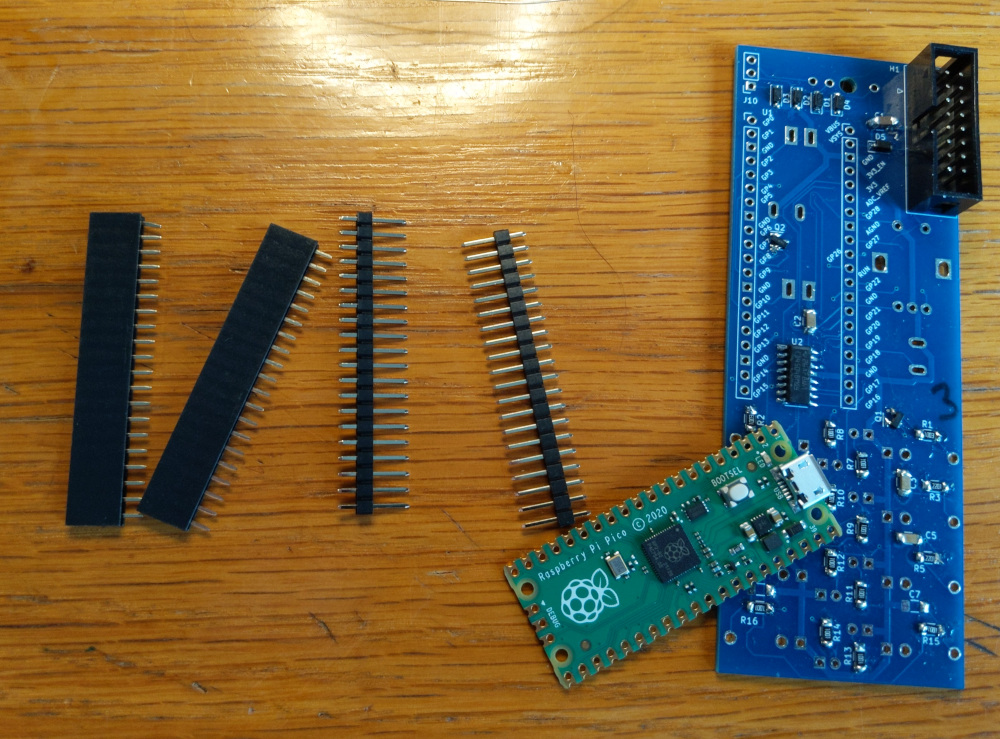
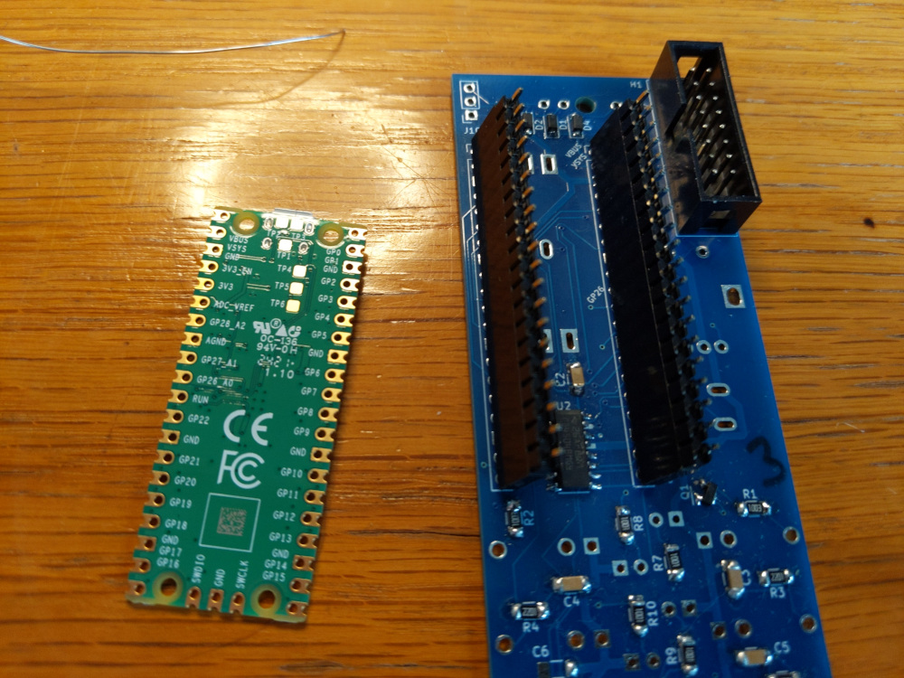
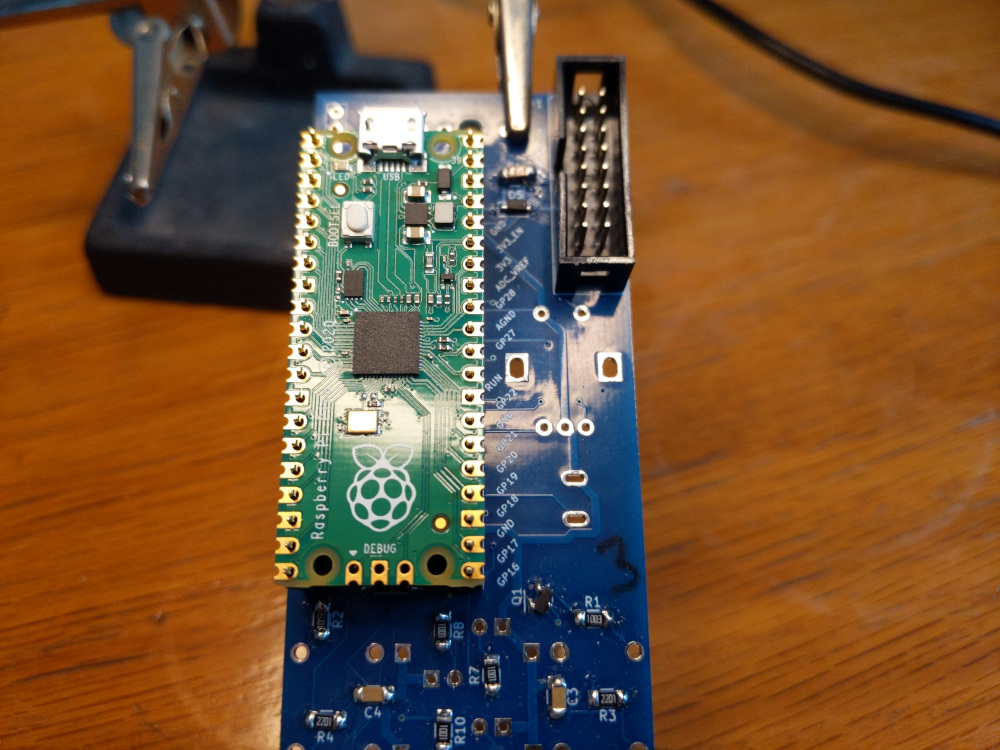


### Pico USB inputs

Connections need to be made from the test points TP1-3 on the underside of the Pico to the USB input socket. 

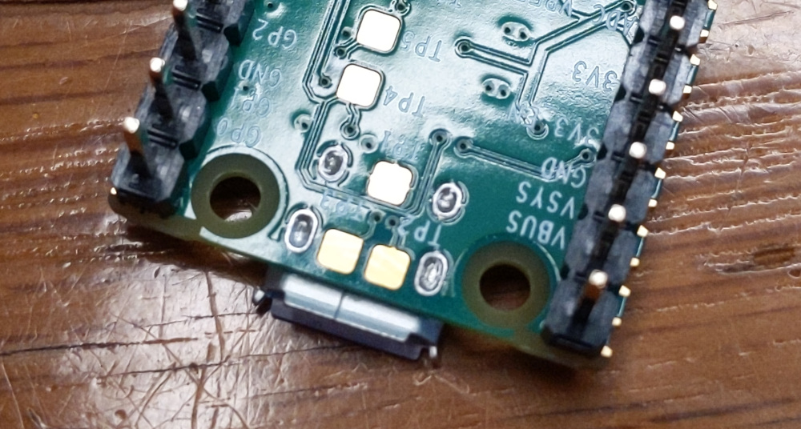

Solder a 3 pin socket onto J10.  The wires will be connected to a 3 pin header that plugs into this.  This means that the board can be removed if needed.

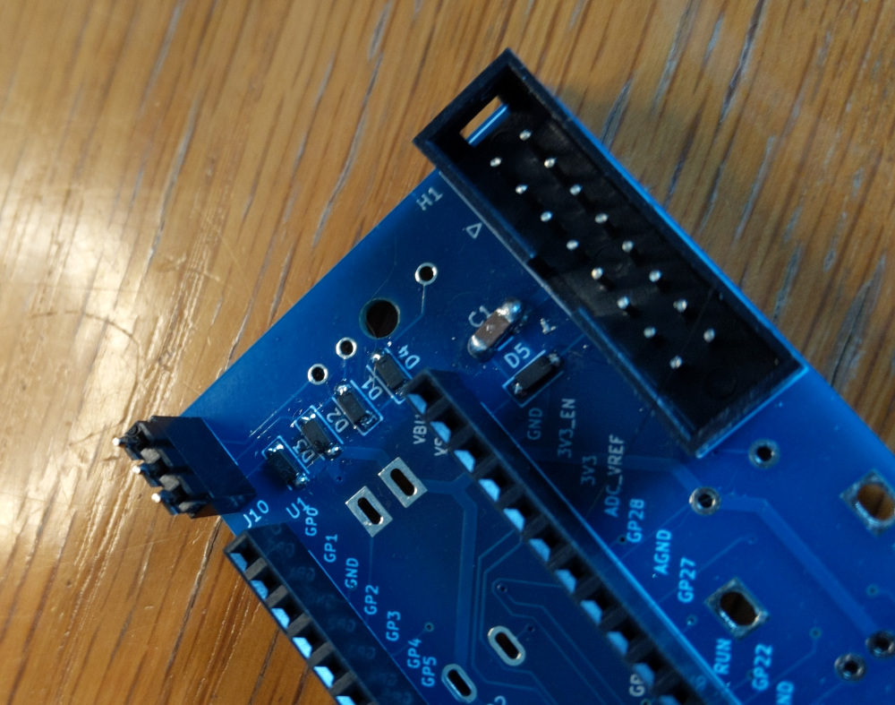

Three short wires (around 3-4cm) need to be soldered onto the test points.  Ideally use multistrand wire as it's less likely to break off.  
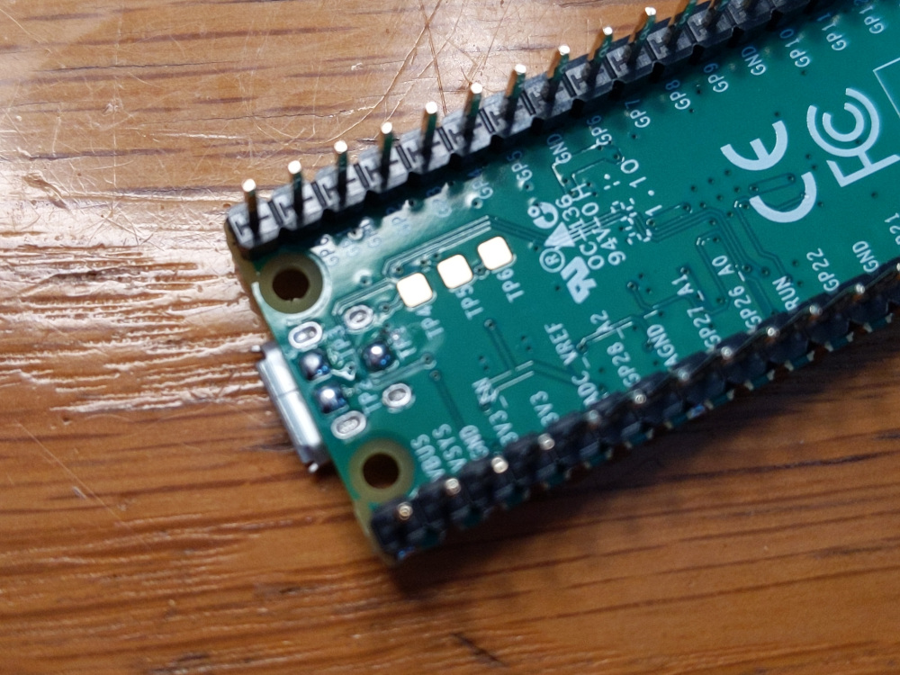

Solder the wires on the pads. This can be a bit tricky, here are some tips:
* Keep the exposed ends very short (a few mm) as the plastic will probably melt back a bit.
* Tin the pads with generous amounts of solder
* Tin the ends of the wires, also with generous amounts of solder
* Tin the tip of the iron, melt the solder on the pad, slide the wire into the molten solder and leave it to cool

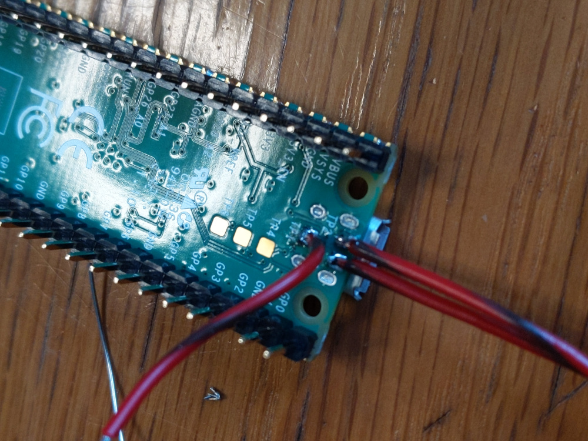

Finally, solder the wires onto a 3-pin header. It can be easy if you mount the Pico and the header in place, and then solder the wires. Tin the header pins, hold the wires in place with some tweezers and press on the soldering iron (or use a wirewrap tool).

GND (TP1) connects to the topmost pin, TP2 -> the centre pin and TP3 to the bottom pin.

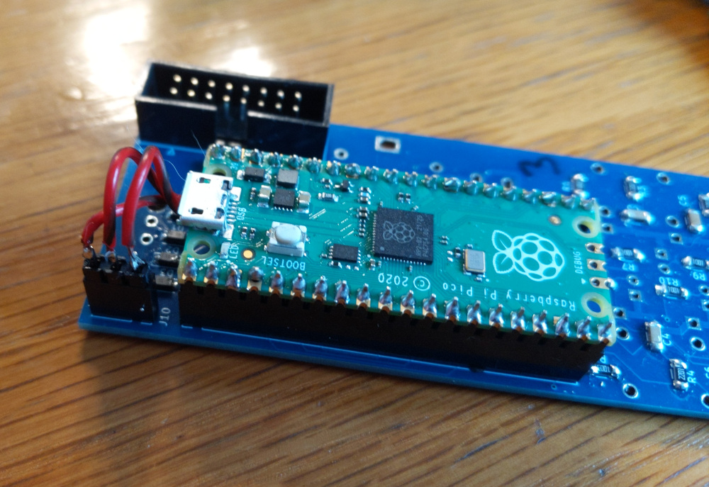


Once connected, you can remove the Pico and continue to mount the remaining components on the front side.

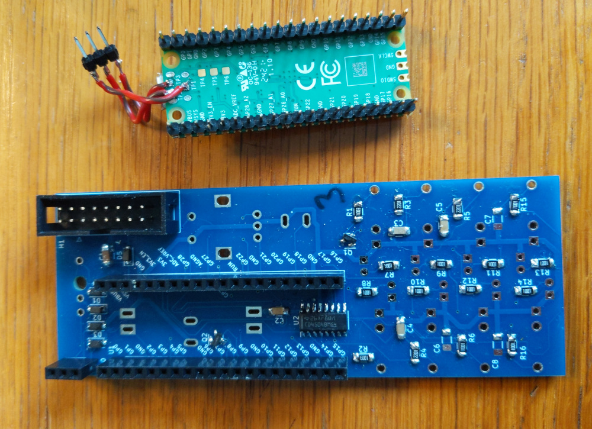


### Making the USB serial cable

For robustness, uSEQ uses a 3.5mm jack for usb connection.  You need to make a custom cable for this.

You will need a USB cable and a stereo 3.5mm jack plug.   The USB cable can be any type, as long as it supports data (i.e. not just a charging cable). Keep the USB-A end, and cut the other one off, you should see 4 wires (if not, it's a charging-only cable).


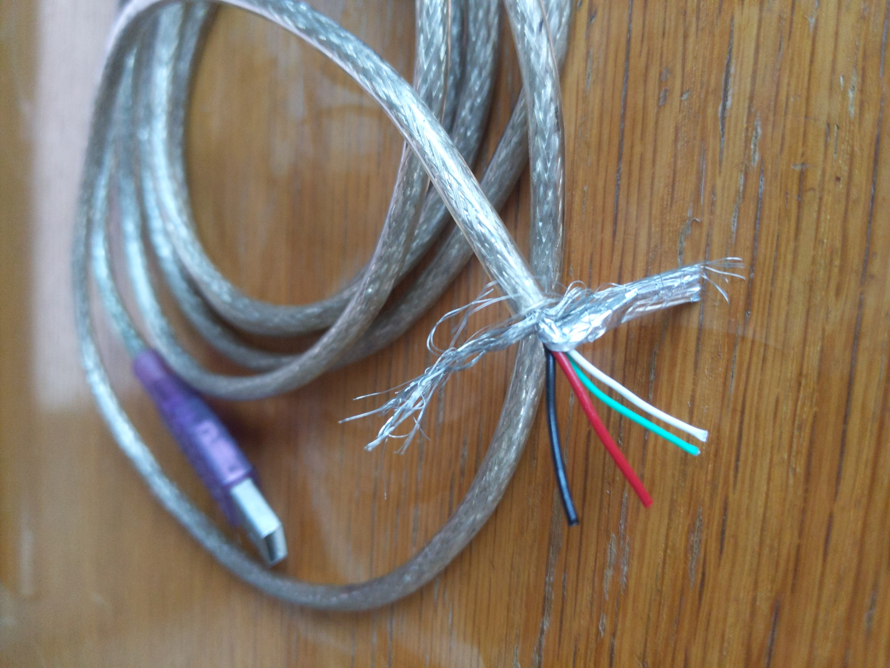

Trim the red power wire; we don't need it because the Pico gets power from the eurorack case.  Trim back the outer section of the cable, and don't forget to put the rear part of the plug onto the cable before you solder.

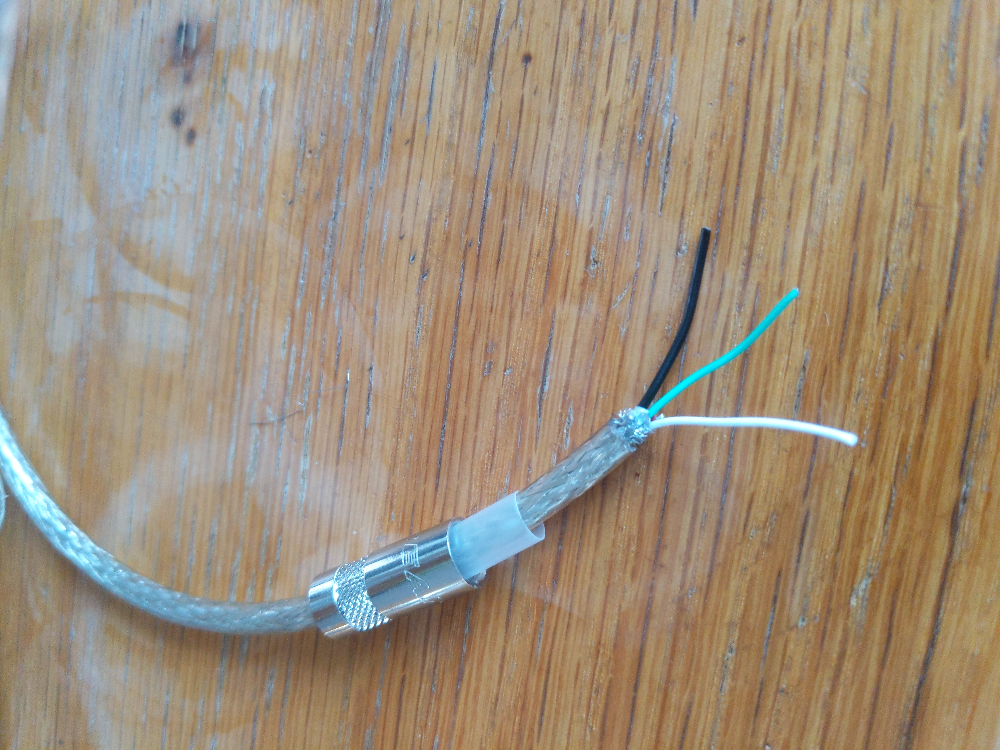

Now you're ready to solder on the plug. 

* Black (Ground) -> Ground
* Green (Data +) -> Tip
* White (Data -) -> Ring

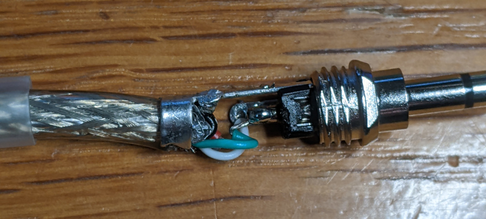


### Testing

First step before putting the module in your rack is to flash the firmware, which is also a great way to check the module is functioning normally.  The module can be run from USB power using the USB port on the pico (but don't plug in eurorack power at the same time).  Connect up the module in this way, and flash the firmware from the Arduino IDE.  When you plug it in, it should appear as a 'UF2 Board' in the ports list.  When the flashing process is complete, you should the LEDs doing a quick animation.  If you press the reset button on the front of the board, you should see this again.

Following this, power up the module from eurorack power, and check it appears in the Arduino IDE.  Try sending some commands through the Arduino serial monitor. e.g.

```
(d1 (sqr beat))
```

will start the D1 LED flashing ... try each of the outputs, analogue and digital.

If you plug an LFO into the digital inputs, you should see the LEDs flashing.


### Troubleshooting

* Can't connect to the module with USB
   * Check if the Pico is working at all
    * Do LEDs flash when you power up?
    * Can you measure a voltage on the power pins? 
   * Try removing the Pico and connecting to it using the Pico's onboard USB port. If this doesn't work, try desoldering the usb wires from the test points, to see if a bridged connection there is an issue.  If it does work, check the order of wiring in the uSEQ USB pinheader.


